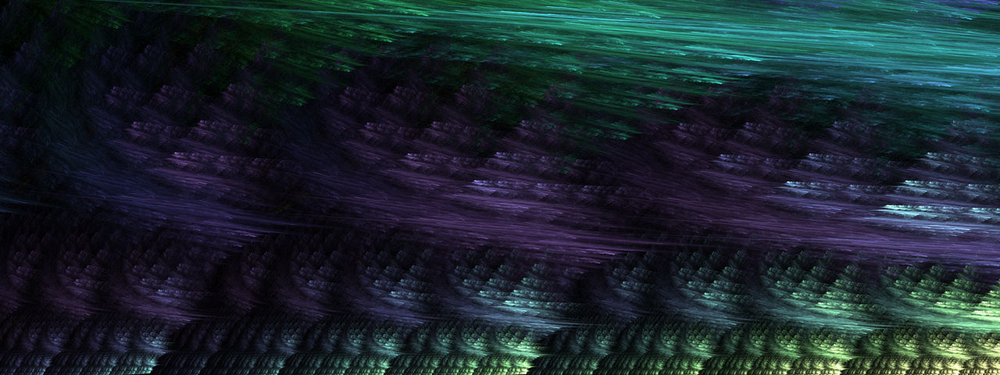

    
   
   
   

# Hello!
I like working with image processing, and making cool utilities.
I have been programming since the start of 2020!

## my interests include:
  * Algorithm Development
  * Complex Analysis
  * Geometric Algebra
  * Quantum Computing
  * Optimization
  * GPGPU
